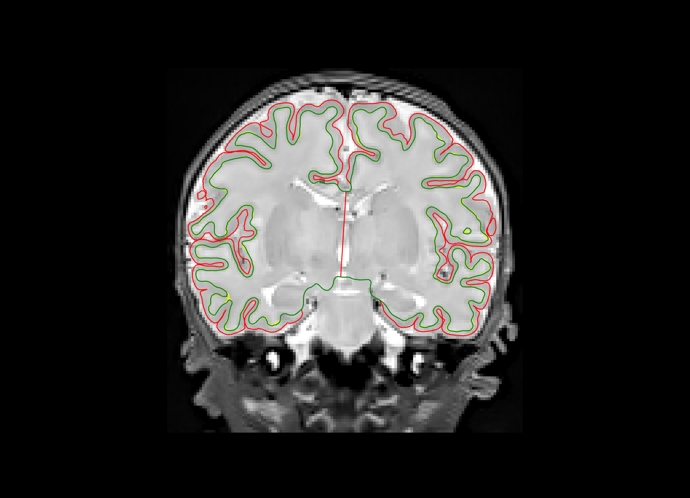
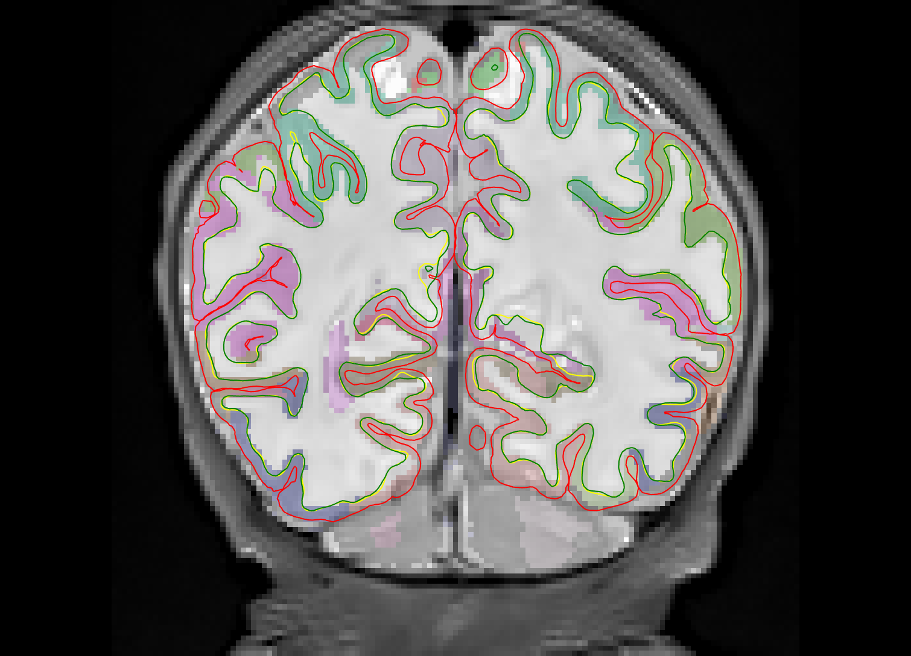
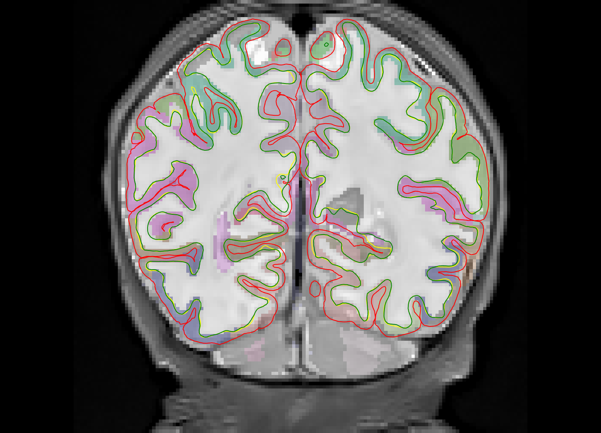
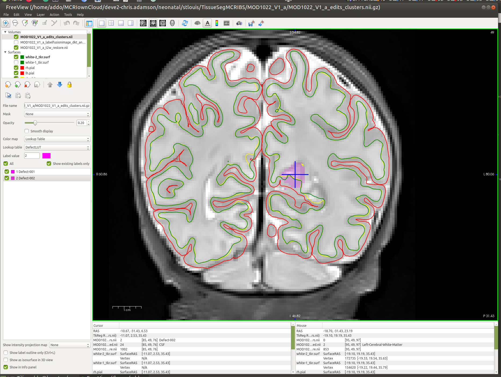
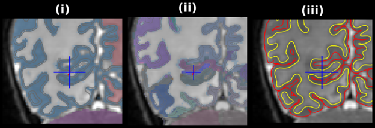

# MCRIBS instructions

## Preparation

Put your T2 images in RawT2:

```
foo1.nii.gz
foo2.nii.gz
foo3.nii.gz
foo4.nii.gz
foo5.nii.gz
```

We will use `foo1` as the example image.

## Neck cropping

Perform neck cropping and resampling with the following command:

```
MCRIBReconAll --neckcrop foo1
```

This crops the original image inferior slices at the base of the cerebellum (to crop the neck off) and removes
dead slices left/right/superior outside the skull; the output image is in T2NeckCropped. That image is resampled
to be isotropic and is placed in T2NeckCroppedIsotropic.

## Voxel labelling

Whole-brain voxel labelling is done with the following command:

```
MCRIBReconAll --tissueseg -openmp XX foo1
```


This step performs whole-brain voxel labelling. Use the -openmp option to enable multithreading with XX denoting the number of threads. Use -openmp
nproc to use all available threads. All outputs from this step are placed in `TissueSegMCRIBS/foo1`

```
all_dkt_to_foo1_gm.nii.gz
all_dkt_to_foo1.nii.gz
all_t2_to_foo1.nii.gz
foo1_brain_mask_inv_dilated.nii.gz
foo1_brain_mask.nii.gz
foo1_brain_mask_unpadded.nii.gz
foo1_brightmask_kmeans_class3_dilated.nii.gz
foo1_brightmask_kmeans_class3.nii.gz
foo1_dark_wm_bright_gm_to_remove.nii.gz
foo1_edits_clusters.nii.gz
foo1InitialAffine.mat
foo1_labelfusion_corticalhulldmap.nii.gz
foo1_labelfusion_dkt_edited.nii.gz
foo1_labelfusion_dkt_edited.nii.gz~
foo1_labelfusion_dkt_antsinit.nii.gz
foo1_labelfusion_dkt_orig.nii.gz
foo1_labelfusion_interhemispheric.nii.gz
foo1_labelfusion_interiormask.nii.gz
foo1_labelfusion_regions_brainstem_cut.nii.gz
foo1_labelfusion_regions.nii.gz
foo1_majority_dkt_compositereg_ribbon.nii.gz
foo1_majority_dkt_skullstrip_reg_choroid_bigdilate.nii.gz
foo1_majority_dkt_skullstrip_reg_choroid_mask.nii.gz
foo1_majority_dkt_skullstrip_reg_isthmus_bigdilate.nii.gz
foo1_majority_dkt_skullstrip_reg_isthmus_to_remove.nii.gz
foo1_majority_dkt_skullstrip_reg.nii.gz
foo1_majority_dkt_with_latvent_rings_skullstrip_reg.nii.gz
foo1_pericalcarine_avg_pos.nii.gz
foo1_segmentation_gm_init.nii.gz
foo1_segmentation_gm.nii.gz
foo1_segmentation_gm_sep_lh.nii.gz
foo1_segmentation_gm_sep.nii.gz
foo1_segmentation_gm_sep_rh.nii.gz
foo1_skullstrip_affine0GenericAffine.mat
foo1_skullstrip_reg0GenericAffine.mat
foo1_skullstrip_reg1InverseWarp.nii.gz
foo1_skullstrip_reg1Warp.nii.gz
foo1_t2w_dark_wm_prob_skullstrip_reg.nii.gz
foo1_t2w_init_restore.nii.gz
foo1_t2w_restore_brain_dn_atropos3_priors_segmentation.nii.gz
foo1_t2w_restore_brain_dn.nii.gz
foo1_t2w_restore_brain.nii.gz
foo1_t2w_restore.nii.gz
foo1_t2w_restore_regmask.nii.gz
foo1_template_affine_reg.nii.gz
foo1_template_initaffine_reg.nii.gz
foo1_template_skullstrip_reg.nii.gz
P01_dkt_with_skull_label_to_foo1.nii.gz
P01_t2_to_foo1.nii.gz
P02_dkt_with_skull_label_to_foo1.nii.gz
P02_t2_to_foo1.nii.gz
P03_dkt_with_skull_label_to_foo1.nii.gz
P03_t2_to_foo1.nii.gz
P04_dkt_with_skull_label_to_foo1.nii.gz
P04_t2_to_foo1.nii.gz
P05_dkt_with_skull_label_to_foo1.nii.gz
P05_t2_to_foo1.nii.gz
P06_dkt_with_skull_label_to_foo1.nii.gz
P06_t2_to_foo1.nii.gz
P07_dkt_with_skull_label_to_foo1.nii.gz
P07_t2_to_foo1.nii.gz
P08_dkt_with_skull_label_to_foo1.nii.gz
P08_t2_to_foo1.nii.gz
P09_dkt_with_skull_label_to_foo1.nii.gz
P09_t2_to_foo1.nii.gz
P10_dkt_with_skull_label_to_foo1.nii.gz
P10_t2_to_foo1.nii.gz
```

Important files (not in order of generation)
 T2 template -> Novel T2 image

- `foo1_template_initaffine_reg.nii.gz`: Affine initializer
- `foo1_template_affine_reg.nii.gz`: Affine
- `foo1_template_skullstrip_reg.nii.gz`: Non-linear
- `foo1 majority dkt skullstrip reg.nii.gz`: Majority vote template labels registered to novel image
- `foo1_t2w_restore.nii.gz`: Bias-corrected after skull stripping
- `foo1_t2w_restore_brain_dn_atropos3_priors_segmentation.nii.gz`: GM/WM/CSF tissue type segmentation
- Candidate cortical GM segmentation
  - `foo1_segmentation_gm.nii.gz` : final
  - `foo1_segmentation_gm_sep.nii.gz`: separated by hemisphere
  - `foo1_segmentation_gm_sep_lh.nii.gz`: LH
  - `foo1_segmentation_gm_sep_rh.nii.gz`: RH
- `foo1_brightmask_kmeans_class3.nii.gz`: Lateral ventricle and central bright area
- Label fusion output
  - `foo1_labelfusion_dkt_orig.nii.gz` : Output of antsJointFusion
  - `foo1_labelfusion_dkt.nii.gz` : After some postprocessing
  - `foo1_labelfusion_dkt_edited.nii.gz` : used for further processing and should be the one used for manual edits

### Viewing voxel labelling output

Using freeview

```bash
cd TissueSegMCRIBS/foo1
freeview foo1_t2w_restore.nii.gz foo1_labelfusion_dkt_edited.nii.gz:colormap=lut:opacity=0.3
```
## Cortical surface extraction

Cortical surface extraction is performed with the following command:

```bash
MCRIBReconAll --surfrecon --openmp XX foo1
```

XX is the number of threads to use. Note this doesnt scale well with lots of threads. Higher clock speed will help you more here. Anyway, surface extraction outputs are placed in `SurfReconDeformable`.

### Inspecting surface output

Checking successful completion of surfaces is done done with the command:

```bash
surfrecon_last_file_made.sh
```

This will
Will produce a tab-delimited list of the last file produced for all subjects in the `SurfReconDeformable` directory:

```
foo1	white-2.vtp
foo2	pial-6.vtp
foo3	cerebrum-1.vtp
foo4	cerebrum-2.vtp
```

All subjects that have pial-6.vtp completed successfully. Other file names indicate an error occurred.

For completed subjects, run the script

```bash
./ FinishedDeformableMCRIBS MOD1022 V1 a
```

This will load the following files:

- Volumes
  - `foo1_t2w_restore.nii.gz` : original t2 image
  - `foo1_labelfusion_dkt_edited.nii.gz` : edited label fusion segmentation
  - `foo1_edits_clusters.nii.gz` : connected components of edits made to the label fusion. (double-
clicking on each label in the label list on the left will focus on the cluster)
- Surfaces
  - `SurfReconDeformable/foo1/temp/white-1 tkr.surf` : Initialization for white matter surface
  - `SurfReconDeformable/foo1/temp/white-2 tkr.surf` : White matter surface, 1st pass
  - `freesurfer/foo1/surf/{l,h}.white` : White matter surfaces
  - `freesurfer/foo1/surf/{l,h}.pial` : Pial surfaces

### Edits

All edits should be done on `foo1_labelfusion_dkt_edited.nii.gz` then to rerun surface
generation, delete the output directory and rerun:

```bash
rm -fr SurfReconDeformable/foo1
MCRIBReconAll --surfrecon -openmp XX foo1
```



### Example in a completed subject

An example of an error that needs to be edited in a completed subject is shown below:



The sulcus under the cursor has been missed by the white matter surface due to being labelled as white matter
(label 2). Fix this by filling it with the CSF label (label 24). This will cause the white matter surface to initialize at the correct position here:



After saving the edits you can rerun the display tool and you will be the edits clusters image will display the voxels you have edited:



### Other errors
If the subject has not completed successfully then we need to assess the last file generated to see if we can find the
error. I have provided a collection of Display scripts to query the errors that I have found so far:

|Last file| script to run |
|---------|---------------|
|cerebrum-1.vtp|DisplayCerebrum1|
|cerebrum-2.vtp|DisplayCerebrum2Error|
|cerebrum-lh-3.vtp|DisplayCerebrum3LHError|
|cerebrum-rh-3.vtp|DisplayCerebrum3RHError|
|cerebrum-lh.vtp|DisplayCerebrumLHError|
|cerebrum-rh.vtp|DisplayCerebrumRHError|
|pial-5.vtp|PialErrorDisplay|

As an example, `foo3` has the last file cerebrum-1.vtp so you would run:

```bash
./DisplayCerebrum1 foo3
```
## White matter label edits

If you need to change a label to a white matter label, use 254 for left hemisphere WM and 255 for right hemisphere WM. The example in the screenshot below shows a thin gyrus that has not been sufficiently
penetrated by the white matter surface. The white matter voxels have been filled in with 255 and upon rerunning, where the edits are preserved, the error is fixed.



## Postprocessing

To generate the post-surface data (revised voxel segmentations, cortical parcellations, voxel label stats, parcellation stats), use the following command:

```bash
rm -fr SurfReconDeformable/foo1
MCRIBReconAll --autoreconaftersurf -openmp XX foo1
```

For the -openmp option I would recommend restricting to the real, physical cores on the system since hypterthreading seems to be much slower in openmp applications.
